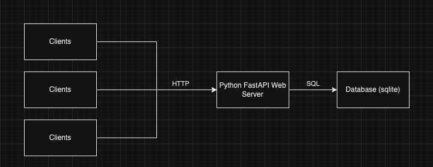
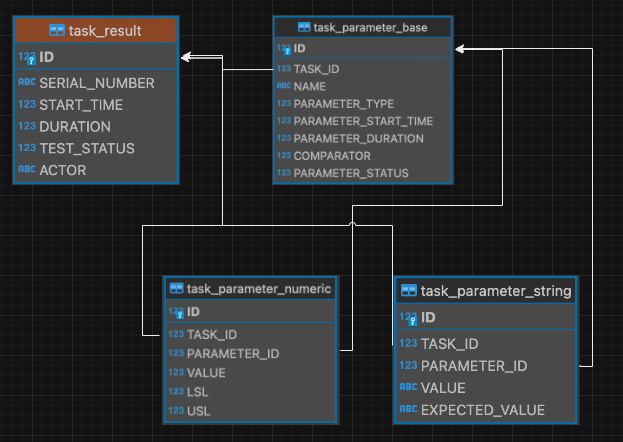
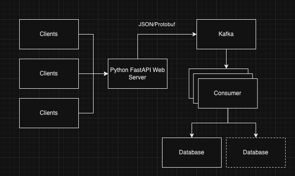

# Task Result Parameters

Task Result Parameters is an HTTP API that consumes results from a set of tasks with parameters and stores them in a 
database.

## Design

TRP is a FastAPI Web server that processes HTTP requests with a JSON payload, then stores it into a database.  
The JSON payload can be found in the swaggerui wherever this project is deployed.

## Dependencies

There are 3 major dependencies to this project.

1. FastAPI - Framework for building APIs
2. Gunicorn/Uvicorn - ASGI server that takes requests and passes it to FastAPI.  (Gunicorn is not included in 
requirements.txt as one can use Uvicorn in development.  The Dockerfile includes gunicorn as the ASGI server)
3. SQLAlchemy - Database Driver/ORM.  This is chosen because one would be able to swap to another database backend by
rewriting some queries, while leaving the query execution interface alone.

## DDL

In TRP, there are 4 tables.  The top-level task_result table, then task_parameter_base table, with two more parameter
tables depending on types of data being inserted.  

A few key points:

1. We split task_parameter into 3 tables to optimize storage space and minimize null values.
2. We don't enforce foreign key constraint in the DDL for scalability.  In other database flavors (MySQL for example), 
in order to partition tables, there must be no foreign key constraints.  the diagram above shows the logical foreign 
keys.
3. Not obvious in the above diagram, but task_parameter_numeric.VALUE is a REAL in sqlite.
4. In other database flavors, one could add other task_parameter_ tables like a JSON table or BLOB table.

## Building and Deploying
The included Dockerfile includes everything needed to build this project. 

TODO:
1.  Set up Github Actions to build automatically run `docker build` on pull request to master or push to master.
2.  Create another Dockerfile for development that includes linting and running tests.

## Improvements

1.  Change to a production-ready database.
2.  Have this API write to a Kafka topic, and create a separate consumer that reads from the topic
and stores it in the database (or databases).  One database could be OLTP to serve a Web UI and another could be for 
OLAP to serve dashboards.

